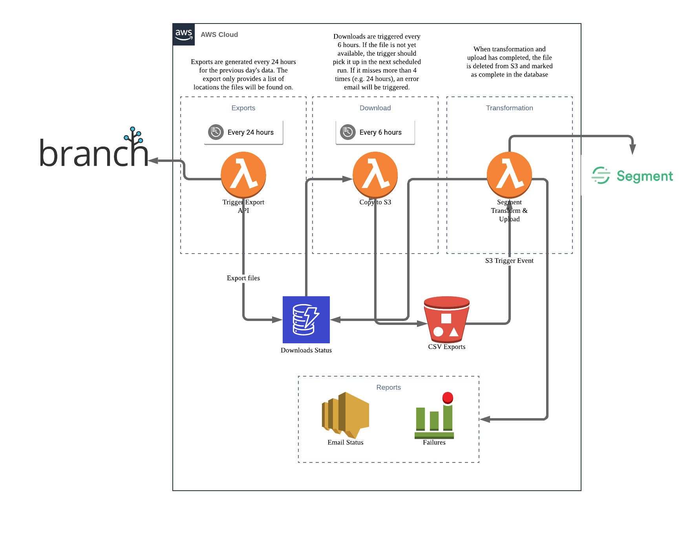
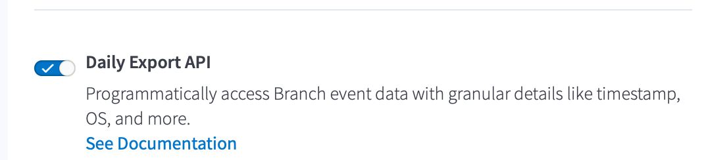
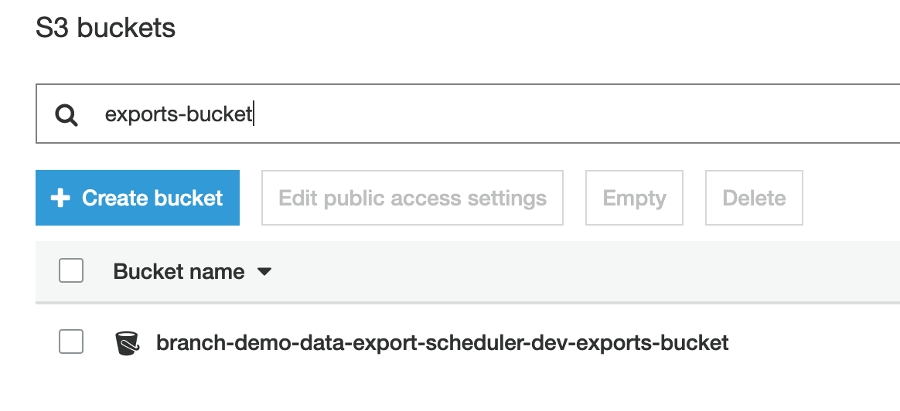
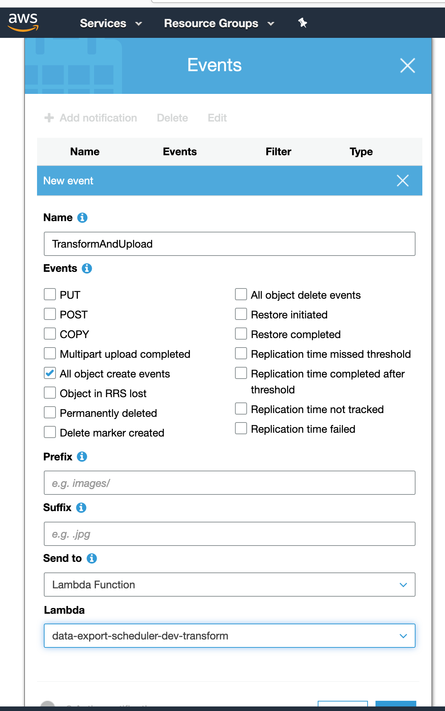
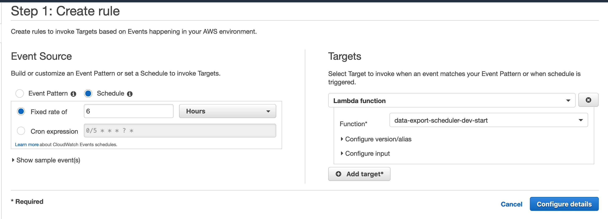

# Overview

This software makes daily, scheduled requests to the Branch Export API and downloads raw log level data to S3. With additional configuration the tool is able to transform and upload the raw data to multiple destinations. Supported destinations are:
  - Segment
  - Mixpanel
  - Amplitude

Please open a PR should you wish to include a new export destination.

# Features
  - Tested to support files up to 1GB in size
  - Automatically expires raw logs after 7 days
  - Simple interactive CLI setup
  - Low cost - runs on Lambda, DynamoDB and S3
  - Automatic retry
  - Error log storage
  - Upload file exclusion support
  - Securely stores all API keys



# Setup

Before starting ensure that you have access to the Branch Data Feeds product and that you have enabled the Daily Export API


Install Homebrew

Run `brew install node`

Install serverless `npm -g install serverless`
Install typescript `npm install -g typescript`

Then run `npm install` from the root folder to install dependencies

Test by running `serverless --help`

Note: You may need to install Docker for deployment to work if you have not installed it already. The simplest is to install Docker Desktop: https://docs.docker.com/install/

Run `npm run install` to configure your serverless environment (note you may need to add your AWS Access Key ID and Secret to the package.json setup script)

If you want to avoid the prompts you can create a `.env` file in the root of your project and add the following:

```
{
  "appName": // your app name - this needs to be unique,
  "stage": // either dev, stg or prd,
  "region": // AWS region e.g. us-east-1,
  "awsAccessKeyId": // AWS key id used to create buckets and upload files,
  "awsSecretKey": // AWS secret key,
  "branchKey": // Branch key off of the Branch dashboard https://branch.dashboard.branch.io/account-settings
  "branchSecret": // Branch secret off of the Branch dashboard https://branch.dashboard.branch.io/account-settings
  "emailReceivers": //Comma seperated list of report receivers to which reports will be sent, these need to be verified on AWS,
  "emailSender": // Email address from which report will be sent,
  "segmentKey": // If using Segment enter your Segment.com write key,
  "segmentExcludedTopics": // Events to exclude from the upload see below,
  "amplitudeKey": // If using Amplitude, your Amplitude API key,
  "amplitudeExcludedTopics": // Events to exclude from the upload see below,
  "mixpanelToken": // Your Mixpanel token,
  "mixpanelExcludedTopics": // Event to exclude from the upload see below,
}
```

Possible event types that can be excluded from being uploaded:   
```
Click
View
Commerce
Content
Install
Open
PageView
Reinstall
SMSSent
UserLifecycleEvent
WebSessionStart
WebToAppAutoRedirect
```

# AWS Setup

If you don't already have an AWS account visit: https://aws.amazon.com to create one.

Next create an IAM User with programmatic access and the following policy permissions:

- SecretsManagerReadWrite
- AWSLambdaFullAccess
- AmazonDynamoDBFullAccess
- AmazonAPIGatewayAdministrator
- AWSCodeDeployRoleForLambda
- AWSDeepRacerCloudFormationAccessPolicy

Save the AWS key and secret for later use

Install the AWS CLI: https://docs.aws.amazon.com/cli/latest/userguide/cli-chap-install.html

*Note:* if you already have the AWS CLI installed make sure the credentials in the `~/.aws/credentials` file match the use you just created above.

# Deployment & Updating

Run `npm run update`

# Post deployment setup

## S3 Bucket trigger

CloudFormation configuration of bucket events has not yet been implemented, so it is important to enable the exports bucket to trigger the transform Lambda on all create events. Follow the steps below to set this up:

1. Open S3: https://s3.console.aws.amazon.com/
2. Navigate to the exports bucket, it should end with the name: `-exports-bucket`

3. Select the Properties tab and scroll to the Advanced settings section
4. Click on the Events tile
5. Add a Notification event similar to the configuration below - making sure that the correct Lambda function is selected


## Enable scheduled events

Cloudwatch events also need to be setup to schedule event triggers on `start` and `download` lambdas. These lambdas are idempotent so running them every few hours is acceptable. Running them more often than this is not necessary. Follow the steps below to enable the scheduled events:

1. Open CloudWatch: https://console.aws.amazon.com/cloudwatch/
2. Make sure the region matches the region you selected when deploying your serverless application e.g. us-east-1
3. From the left menu select Events -> Rules
4. Press the Create Event button and configure your event as shown

5. Name the event `Export` and Save
6. Create a second event with the following configuration

7. Name your event `Download` and Save

All setup at this point should be complete.
